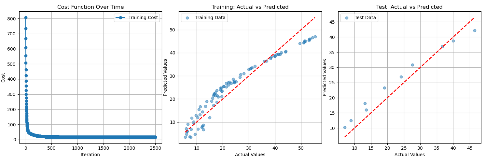
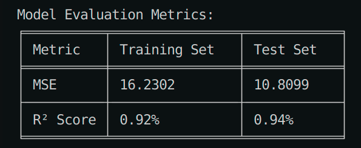

# Linear Regression from Scratch

This project implements Linear Regression from scratch using Python, demonstrating the core concepts of machine learning including gradient descent optimization, model evaluation, and data visualization.



## 🚀 Features

- **Pure Python Implementation**: Built from scratch using NumPy for matrix operations
- **Gradient Descent Optimization**: Custom implementation of gradient descent algorithm
- **Train-Test Split**: Proper data splitting for model evaluation
- **Model Evaluation**: Comprehensive metrics including MSE and R² Score
- **Visualization**: Multiple plots to understand model performance

## 📋 Requirements

```bash
numpy
pandas
matplotlib
scikit-learn
tabulate
```

## 🛠️ Installation

1. Clone the repository:
```bash
git clone https://github.com/Elnagar74/Linear-Regression-From-Skratch.git
cd Linear-Regression
```

2. Install the required packages:
```bash
pip install -r requirements.txt
```

## 📊 Usage

1. Prepare your data in CSV format with the target variable in the last column
2. Run the main script:
```python
python LinearRegression.py
```

## 🔍 Code Structure

### Main Components

1. **Data Preparation** (`prepare_data`):
   - Splits data into training and testing sets
   - Adds bias term to features
   - Handles data preprocessing

2. **Cost Function** (`cost_func`):
   - Implements Mean Squared Error (MSE)
   - Measures model performance

3. **Gradient Computation** (`compute_gradient`):
   - Calculates gradients for optimization
   - Essential for gradient descent

4. **Gradient Descent** (`gradient_Descent`):
   - Implements optimization algorithm
   - Updates weights iteratively
   - Tracks cost history

5. **Model Evaluation** (`evaluate_model`):
   - Calculates MSE and R² Score
   - Evaluates model performance

6. **Visualization** (`visualize_training`):
   - Cost function over time
   - Training data predictions
   - Test data predictions

### Key Parameters

- `learning_rate`: Controls step size in gradient descent (default: 0.001)
- `precision`: Convergence threshold (default: 0.00001)
- `max_iter`: Maximum iterations (default: 2500)
- `test_size`: Proportion of data for testing (default: 0.1)

## 📈 Output

The program provides:

1. **Training Metrics**:
   - MSE (Mean Squared Error)
   - R² Score

2. **Test Metrics**:
   - MSE (Mean Squared Error)
   - R² Score

3. **Visualizations**:
   - Cost function convergence plot
   - Training data predictions
   - Test data predictions

## 🎯 Example

```python
data_path = 'Student_Marks.csv'
w, train_metrics, test_metrics = train_linear_regression(data_path)
```

## 📝 Notes

- The implementation uses vectorized operations for efficiency
- Gradient descent includes early stopping based on precision
- Visualizations help in understanding model behavior
- R² Score is presented as a percentage for better interpretation


